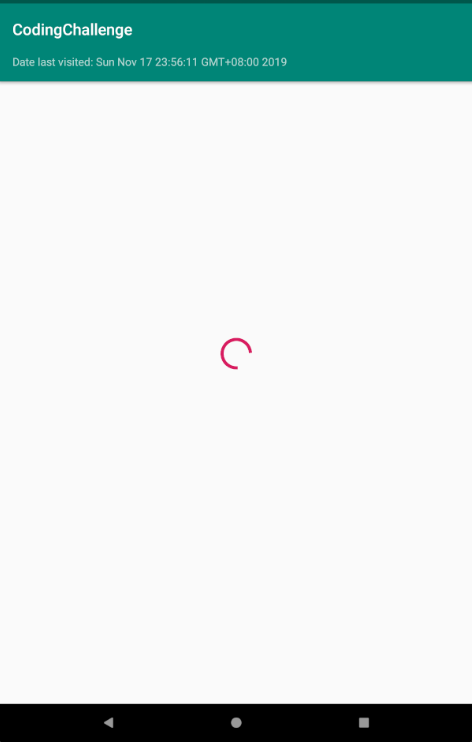
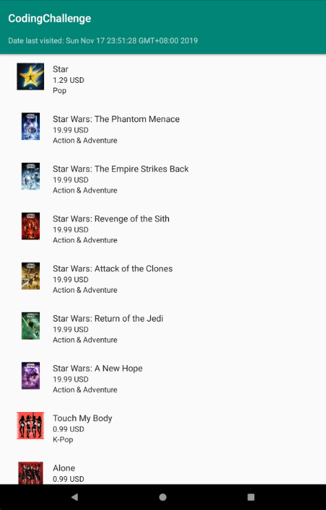
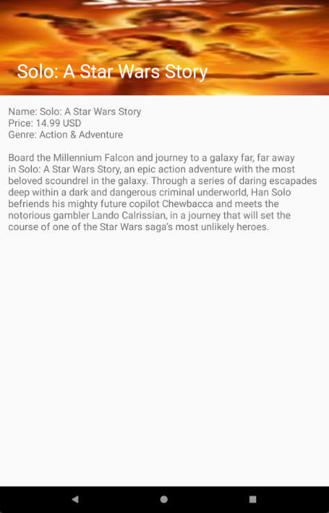
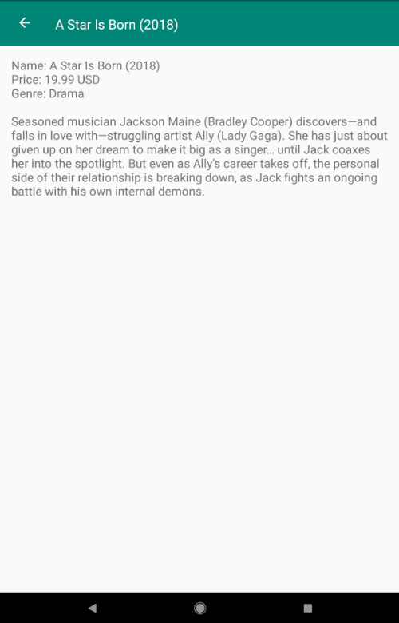
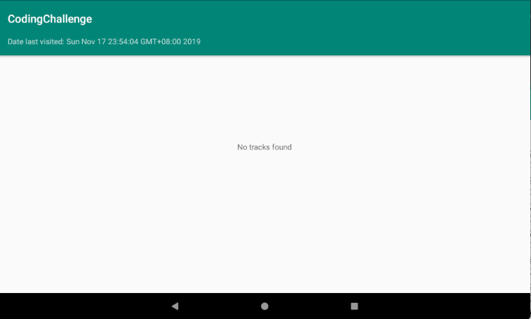
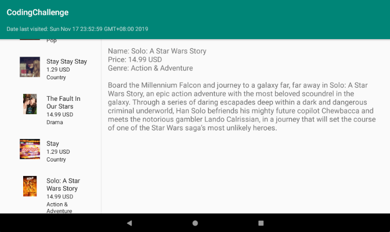

# coding-challenge

A master-detail application that displays a list of items obtained from a iTunes Search API and show a detailed view of each item. The data is obtained from:
 
&emsp;&emsp;   https://itunes.apple.com/search?term=star&amp;country=au&amp;media=movie&amp;all
 
The list shows the following details from the API:
 
&emsp;Track Name
 
&emsp;Artwork
 
&emsp;Price
 
&emsp;Genre
 
&emsp;In addition, the detail view shows the Long Description for the given item.
 
 
The app is based of Android Studio's built-in master-flow template which uses Material Design and a RecyclerView for the list of items.

 
Some libraries used in the app:

 
&emsp;  For handling the API and JSON:
 
&emsp;&emsp;    Retrofit
 
&emsp;&emsp;    Moshi
 
  
 
&emsp;  For loading the images:
 
&emsp;&emsp;    Picasso
 
 
&emsp;  Others:
 
&emsp;&emsp;    ViewModel and LiveData
 
&emsp;&emsp;    Coroutines
 
 
Design pattern used:
 
&emsp;MVVM
 
&emsp; I had the hardest time choosing what design pattern to use. I have been used to developing using MVC and for such a simple app, MVP and MVC were probably the simplest to use and the quickest to catch on. But I decided to use MVVM (Model View ViewModel) for this app. Looking at articles online about android architecures I'd often see MVVM being talked about and how it's all the fuss. 
 
The reasons I chose this design pattern is:
 
&emsp;&emsp;Data Binding sounds and looks cool
 
&emsp;&emsp;Easier unit tests (although I don't have unit tests here)
 
&emsp;&emsp;It's supposedly makes your life easier (don't know about this one)
 
&emsp;&emsp;It's a clean and trusted architecture
 

Although it was very challenging keeping the app strictly MVVM, I had fun and learned a lot from the 2 days of practicing this. Hopefully, in the future, using MVVM would be second nature.
 

And to keep it simple, I only used SharedPreferences to save and load the last time the user visited the app, shown inside the list header.
 

<h2>Screenshots</h2>
<h5> Loading screen while the data is being fetched</h5>

<h5> Main screen after the data has been loaded</h5>

<h5> Detailed screen when clicking an item</h5>

<h5> Detatiled screen when scrolling down</h5>

<h5> Error screen when data failed to load (e.g. no internet)</h5>

<h5> Tablet version of the main screen + details screen</h5>

