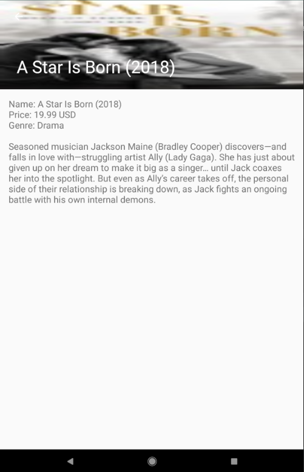

# coding-challenge

A master-detail application that displays a list of items obtained from a iTunes Search API and show a detailed view of each item. The data is obtained from:
    https://itunes.apple.com/search?term=star&amp;country=au&amp;media=movie&amp;all

The list shows the following details from the API: 
Track Name
Artwork
Price
Genre
In addition, the detail view shows the Long Description for the given item.

The app is based of Android Studio's built-in master-flow template which uses Material Design and a RecyclerView for the list of items.

Some libraries used in the app:

  For handling the API and JSON:
    Retrofit
    Moshi
  
  For loading the images:
    Picasso
    
  Others:
    ViewModel and LiveData
    Coroutines

Design pattern used:
MVVM

And to keep it simple, I only used SharedPreferences to save and load the last time the user visited the app, shown inside the list header.

<h2>Screenshots</h2>
 

